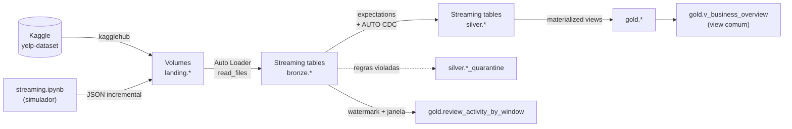

# Yelp Dataset - Data Lakehouse com Databricks e Delta Lake

Pipeline de dados sobre o [Yelp Academic Dataset](https://www.kaggle.com/datasets/yelp-dataset/yelp-dataset) (Kaggle), construído como um pipeline **DLT (Lakeflow Declarative Pipelines) em SQL** no Databricks com Unity Catalog. Segue a arquitetura medalhão landing → bronze → silver → gold, orquestrada por Databricks Jobs definidos num Asset Bundle (`databricks.yml` + `resources/*.yml`).

O dataset tem cinco arquivos JSON Lines (negócios, reviews, dicas, usuários e check-ins), cada um com schema próprio e chave natural: cerca de 7 milhões de reviews, 2 milhões de usuários, 150 mil negócios, 900 mil dicas e 130 mil check-ins.

O projeto parte do pipeline da disciplina anterior (notebooks PySpark `load_bronze`, `load_silver`, `load_gold` e um par produtor/consumidor de streaming). A lógica medalhão foi reescrita em SQL no DLT e os notebooks antigos saíram da entrega, mas continuam no histórico do Git. As 18 tabelas que eles criavam foram removidas com `DDL/drop-tables.sql`, porque o DLT não assume tabelas já existentes com o mesmo nome.

O relatório completo, com prints e resultados das execuções, está em `Relatório de Entrega - Renato Pires.pdf`.

## Arquitetura



- **Catálogo**: `yelp_dataset`, isolado do catálogo compartilhado da disciplina e de outros projetos no mesmo workspace.
- **Schemas**: `landing` (Volumes gerenciados com JSON bruto), `bronze`, `silver`, `gold` e `governance` (função de máscara + event log do pipeline).
- **Pipeline DLT** `yelp_dataset_dlt` (`src/dlt/*.sql`, `resources/yelp_dlt_pipeline.yml`): serverless, triggered (`continuous: false`). O DLT monta o grafo a partir das próprias consultas, sem `depends_on` entre camadas, e cada update processa o que chegou desde o último checkpoint.
- Catálogo, schemas e Volumes vêm de `DDL/create-catalog.sql` (todo `CREATE` é `IF NOT EXISTS`). As tabelas de bronze, silver e gold não estão na DDL: o pipeline cria e gerencia todas elas.

## Estrutura do repositório

| Caminho | Papel |
|---|---|
| `DDL/create-catalog.sql` | Catálogo, schemas e Volumes da landing |
| `DDL/create-views.sql` | View comum sobre a gold (aplicada depois do pipeline) |
| `DDL/drop-tables.sql` | Remoção manual das tabelas antigas; nunca entra num job |
| `DCL/create-role.sql` | Documentação dos grupos e função de máscara do CPF |
| `DCL/grants.sql` | Privilégios por grupo e camada |
| `src/dlt/01_bronze.sql`, `02_silver.sql`, `03_gold.sql` | Pipeline DLT |
| `src/config.py` | Datasets, caminhos dos Volumes, chaves naturais (`DEDUP_KEYS`) e schemas (`BRONZE_SCHEMAS`), espelhados no SQL do DLT |
| `src/apply_ddl.ipynb` | Aplica uma lista de arquivos SQL de forma idempotente |
| `src/download_landing.ipynb` | Baixa do Kaggle só os arquivos que faltam nos Volumes da landing |
| `src/streaming.ipynb` | Simulador de carga incremental (inserts, updates e registros inválidos) |
| `src/audit/time_travel.sql` | Protocolo Delta, histórico, time travel e CDF para SCD 1 e 2 |
| `src/monitoring/dq_report.sql` | Data Quality Report e métricas do pipeline a partir do event log |
| `resources/yelp_dlt_pipeline.yml` | Definição do pipeline DLT |
| `resources/yelp_pipeline_job.yml`, `resources/streaming_simulator_job.yml` | Jobs de carga inicial e incremental |

## Camadas

| Camada | Tipo | O que tem |
|---|---|---|
| `landing` | Volumes | JSON Lines original do Kaggle + lotes do simulador em `review/incremental/` |
| `bronze` | Streaming tables | Auto Loader (`STREAM read_files`) com schema explícito, `_rescued_data`, `_source_file`, `_ingested_at`; expectations só medem |
| `silver` | Streaming tables | Expectations com `DROP ROW` (views temporárias `*_validated`), quarentena `*_quarantine`, `AUTO CDC` por chave natural; `review` (SCD 1) + `review_history` (SCD 2); `rating_band` em `business`; `user.cpf` simulado e mascarado |
| `gold` | Materialized views + 1 streaming table + 1 view comum | `dim_business`, `dim_user`, `fact_business_metrics`, `fact_user_metrics`, `summary_metrics`, pivots `business_by_state` e `review_by_month`; `review_activity_by_window` (watermark 10 min, janela 5 min); `v_business_overview` |

Na bronze, campos aninhados e heterogêneos (`attributes`, `hours`) ficam como STRING com o JSON bruto. Valores que não casam com o tipo declarado viram NULL e o original vai para `_rescued_data`.

`review_activity_by_window` lê a bronze, e não a silver, porque `silver.review` recebe updates do CDC e deixa de ser append-only. Eventos mais antigos que o watermark são descartados, como os updates de nota do simulador, que reaproveitam datas históricas.

### Qualidade (expectations)

Regras derivadas do schema e das colunas ingeridas: chave natural não nula, `_rescued_data IS NULL` (valor fora do tipo declarado), colunas essenciais preenchidas e domínio coerente com o tipo (`stars` 1–5, contadores ≥ 0, datas não futuras, lat/long válidas). Na bronze as regras só geram métricas; na silver o registro é descartado e vai para a quarentena com a lista de regras violadas em `_failed_rules`.

Resultado acumulado da carga inicial e do primeiro lote incremental: 7 registros reprovados em `review_validated`. Cinco vêm do próprio dataset do Kaggle (`useful`, `funny` ou `cool` negativos) e dois são as notas 9 injetadas pelo simulador. Os demais datasets passaram sem reprovação.

### CDC

O simulador (`src/streaming.ipynb`) amostra reviews da silver, embaralha e grava um lote JSON Lines em `landing/review/incremental/batch_<timestamp>/`:

- 30% das linhas mantêm o `review_id` original, com nota diferente e data 1 a 30 dias maior (update);
- o restante recebe `review_id` e `user_id` novos (`uuid()`) e data atual (insert);
- 2% dos inserts recebem nota 9, fora da faixa válida.

O simulador só grava arquivos, nunca tabelas. O `AUTO CDC ... SEQUENCE BY date` consolida a versão mais recente em `silver.review` e guarda o histórico de `stars` e `date` em `silver.review_history`. Os demais datasets usam `AUTO CDC` SCD 1 com `SEQUENCE BY _ingested_at` para deduplicar; em `tip`, que tem 79 chaves repetidas no arquivo original, o desempate usa `STRUCT(_ingested_at, text, compliment_count)`.

No lote de 300 linhas, o MERGE em `silver.review` registrou 83 updates e 215 inserts, e 2 linhas foram para a quarentena. As 83 reviews alteradas ficaram com duas versões em `review_history`.

## Governança

- Os grupos `data_engineering`, `data_analyst` e `business_analyst` foram criados com `databricks groups create`, porque o Unity Catalog não tem `CREATE ROLE`/`CREATE GROUP` em SQL.
- `DCL/grants.sql` define o acesso pretendido: engenharia com `ALL PRIVILEGES` no catálogo; `data_analyst` lê silver e gold com CPF mascarado; `business_analyst` só lê a gold.
- `governance.mask_cpf` (em `DCL/create-role.sql`) mostra só os dois dígitos verificadores para os grupos de analistas. A função testa `is_member()` (grupo local do workspace) e `is_account_group_member()` (grupo de conta). A máscara fica na definição das tabelas do DLT (`silver.user.cpf`, `gold.dim_user.cpf`), porque tabelas geridas pelo pipeline não aceitam `ALTER TABLE ... SET MASK` de fora.
- O Unity Catalog captura o lineage landing → bronze → silver → gold → view a partir das execuções do pipeline, sem configuração adicional.

**Limitação do Free Edition**: grupos criados no workspace são locais, e o Unity Catalog só concede privilégios a identidades de conta. Sem acesso ao account console, os `GRANT` por grupo não podem ser aplicados. `src/apply_ddl.ipynb` trata esse erro específico como aviso e lista cada `GRANT` não aplicado; qualquer outro erro derruba o job. Num workspace com account console (ou Terraform), basta criar os três grupos na conta e reaplicar o mesmo `grants.sql`.

## Otimização e manutenção

- Z-Order (`pipelines.autoOptimize.zOrderCols`) em `silver.review` e `silver.tip` por `business_id, date`, as colunas que a gold usa para filtrar e agrupar. As demais tabelas usam liquid clustering (`CLUSTER BY`); review e tip ficam de fora porque os dois recursos são mutuamente exclusivos.
- Deletion vectors e Change Data Feed habilitados. No MERGE do lote incremental, o Delta marcou as 83 linhas antigas com 33 deletion vectors e não reescreveu nenhuma (`numTargetRowsCopied = 0`).
- Manutenção automática do DLT (`pipelines.autoOptimize.managed = true`) com retenções explícitas (`logRetentionDuration = 30 days`, `deletedFileRetentionDuration = 7 days`). O OPTIMIZE já aparece no histórico; o VACUUM só roda depois da retenção de 7 dias.
- Compute serverless em tudo: o Free Edition não permite cluster clássico, então não há enhanced autoscaling com `min_workers`/`max_workers`.

## Orquestração

Dois Databricks Jobs disparam o mesmo pipeline DLT, com `max_concurrent_runs: 1` + fila e sem `full_refresh`, que apagaria o estado do `AUTO CDC` e os checkpoints:

| Job (chave no bundle / nome no workspace) | Tasks | Gatilho |
|---|---|---|
| `yelp_pipeline` / `yelp_dataset_pipeline` | `apply_ddl → download_landing → run_pipeline → apply_grants` | manual (carga inicial/setup) |
| `streaming_simulator` / `yelp_streaming_simulator` | `run_simulator → run_pipeline` | periódico de 1h (pausado por padrão) |

`apply_ddl` (notebook `src/apply_ddl.ipynb`) aplica uma lista de arquivos SQL: antes do pipeline o catálogo/schemas/volumes e a função de máscara; depois dele as views comuns e os `GRANT`, que dependem das tabelas criadas pelo DLT.

Só o pipeline escreve em bronze, silver e gold. Não há gatilho por chegada de arquivo, que seria uma terceira origem de execução. Um full refresh exigiria rodar `DDL/drop-tables.sql` antes.

## Auditoria e métricas

- `src/audit/time_travel.sql`: `DESCRIBE DETAIL`/`HISTORY`, `VERSION AS OF`, `table_changes` e histórico SCD 2. A mesma alteração de nota aparece no time travel, na versão encerrada de `review_history` e no `update_preimage`/`update_postimage` do CDF.
- `src/monitoring/dq_report.sql`: Data Quality Report a partir do event log (`governance.pipeline_event_log`), volume por flow, duração dos updates, estratégia de refresh das MVs e teste de data skipping. Como `review_validated` alimenta dois flows, a consulta soma por flow e fica com o maior valor por update para não contar cada review duas vezes.

Resultados registrados no event log:

| Update | Linhas lidas na bronze | Upserts em `silver.review` | Refresh de `fact_business_metrics` | Duração |
|---|---|---|---|---|
| Carga inicial | 6.990.280 | 6.990.275 | `COMPLETE_RECOMPUTE` | 343 s |
| Lote do simulador | 300 | 298 | `GROUP_AGGREGATE` (381 linhas alteradas) | 205 s |
| Reexecução sem dados novos | 0 | 0 | `NO_OP` | 116 s |

A maior parte dos 205 s do lote incremental é custo fixo de inicialização e planejamento do serverless. A MV só reagregou as 381 linhas alteradas porque as tabelas da silver têm Change Data Feed e row tracking.

## Pontos em aberto

- `GRANT` por grupo depende de grupos de conta (ver Governança). Uma alternativa que funciona hoje é conceder privilégios a `account users` ou a usuários individuais.
- Os `CREATE FLOW` da silver aparecem no event log como `yelp_dataset.bronze.<flow>`, porque herdam o schema padrão do pipeline. Renomear reiniciaria o checkpoint dos flows e reprocessaria a bronze inteira.

## Como rodar

Requer `uv` (Python 3.12) e o Databricks CLI autenticado no workspace.

```bash
uv sync                                    # dependências locais
databricks bundle validate                 # valida o bundle sem alterar o workspace
databricks bundle deploy                   # cria/atualiza pipeline e jobs no Databricks
databricks bundle run yelp_pipeline        # setup + carga inicial via DLT
databricks bundle run streaming_simulator  # lote incremental (inserts/updates) + update do pipeline
```
