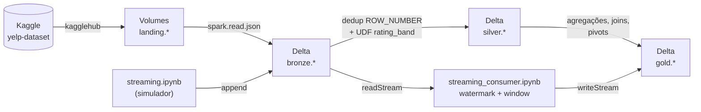

# Yelp Dataset - Pipeline Spark/Databricks

Pipeline de dados distribuído sobre o [Yelp Academic Dataset](https://www.kaggle.com/datasets/yelp-dataset/yelp-dataset) (Kaggle), construído em Apache Spark e Databricks com Unity Catalog. Combina ingestão em lote (arquitetura medalhão landing → bronze → silver → gold) com um pipeline de Structured Streaming, tudo orquestrado como Databricks Jobs via Asset Bundle e versionado neste repositório.

## Arquitetura



- **Catálogo**: `yelp_dataset`, isolado do catálogo compartilhado da disciplina e de outros projetos no mesmo workspace.
- **Camadas (schemas)**: `landing` (Volumes com o JSON bruto do Kaggle) → `bronze` (Delta, schema tipado + metadados de ingestão) → `silver` (deduplicado, sem colunas de controle) → `gold` (dimensões, métricas e pivots para BI).
- **Governança**: todos os objetos são gerenciados pelo Unity Catalog; lineage ponta a ponta é capturado automaticamente pelo UC a partir da execução real do pipeline.


## Dados

Cinco datasets do Yelp, um por Volume/tabela: `business`, `review`, `user`, `checkin`, `tip`. Os arquivos são JSON Lines (um objeto por linha).

| Camada | O que tem |
|---|---|
| `landing` | Um Volume gerenciado por dataset, com o JSON original baixado do Kaggle |
| `bronze` | Schema tipado (`config.py`), campos aninhados/heterogêneos (`attributes`, `hours`) mantidos como STRING; colunas `_source_file` e `_ingested_at` para lineage |
| `silver` | Deduplicado via `ROW_NUMBER()` sobre a chave natural de cada dataset; `business` ganha `rating_band` (Baixa/Média/Alta), calculado por UDF a partir de `stars` |
| `gold` | `dim_business`, `dim_user`, `fact_business_metrics`, `fact_user_metrics`, `summary_metrics`, pivots (`business_by_state`, `review_by_month`) e o sink do streaming (`review_activity_by_window`) |

## Pipeline batch

Orquestrado como um Databricks Job (`resources/yelp_pipeline_job.yml`), com as tasks encadeadas via `depends_on`:

```
apply_ddl → download_landing → load_bronze → load_silver → load_gold
```

- `apply_ddl` aplica `DDL/create-catalog.sql` no metastore a cada execução (catálogo, schemas, Volumes e tabelas são `IF NOT EXISTS`; `ALTER TABLE ADD COLUMNS` idempotente via tratamento de erro), garantindo que o schema esteja sempre sincronizado antes do resto rodar.
- `download_landing` verifica o que já existe na `landing` e só baixa do Kaggle (via `kagglehub`) o que estiver faltando.
- `load_bronze`, `load_silver`, `load_gold` fazem a transformação camada a camada em PySpark/Spark SQL.

Todas as tasks rodam em compute serverless (sem cluster próprio definido); `download_landing` declara `kagglehub` como dependência via `environments` (formato de ambiente serverless, não `%pip`).

## Streaming

Dois notebooks separados do pipeline batch, orquestrados por outro Job (`resources/streaming_simulator_job.yml`):

- **`streaming.ipynb`** (produtor/simulador): amostra reviews existentes em `bronze.review` e reinsere como "novas" (via `append`), com `review_id`/`user_id` sintéticos (`uuid()`) e `date` = agora, gerando um fluxo contínuo de dados sem colidir com chaves reais.
- **`streaming_consumer.ipynb`**: lê `bronze.review` via `spark.readStream`, aplica watermark de 10 minutos sobre `date`, agrega em janelas de 5 minutos por `business_id` (contagem de reviews e média de estrelas), e grava em `gold.review_activity_by_window` com `trigger(availableNow=True)` (processa o disponível e encerra, dispensa cluster sempre ligado) e checkpoint em `/Volumes/yelp_dataset/gold/checkpoints/`.

> `bronze.review` também é reescrita com `mode("overwrite")` por `load_bronze`; um streaming read do Delta não aceita isso como fonte pura de append. Depois da carga batch inicial, só o simulador deve continuar escrevendo ali enquanto o consumer estiver ativo.

## Como rodar

Requer `uv` (Python 3.12) e o Databricks CLI autenticado no workspace.

```bash
uv sync                                  # dependências locais (exploração em src/client.ipynb, se houver)
databricks bundle validate               # valida o bundle sem alterar o workspace
databricks bundle deploy                 # cria/atualiza os Jobs no Databricks
databricks bundle run yelp_pipeline      # roda o pipeline batch completo
databricks bundle run streaming_simulator  # gera carga sintética + consome via streaming
```